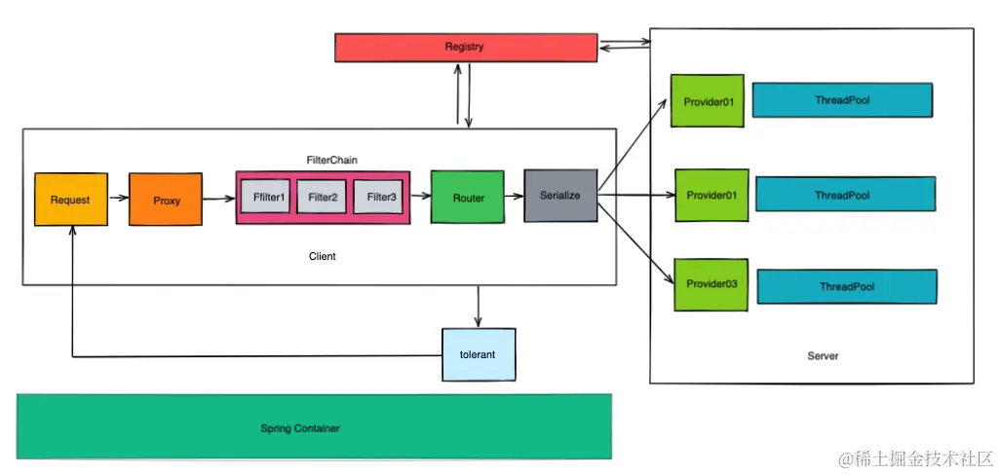
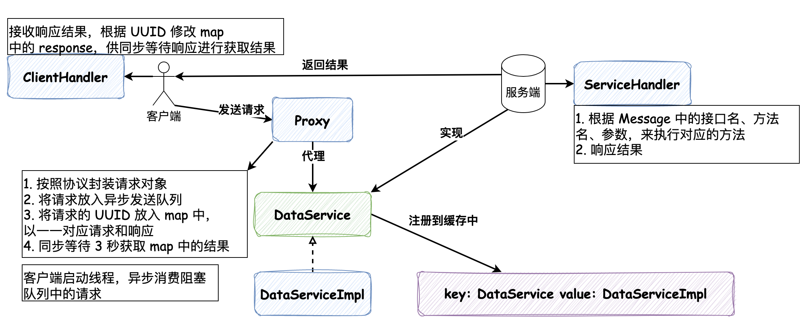

## [《Java 开发者的RPC实战课》](https://juejin.cn/book/7047357110337667076)

### 1. RPC 框架整体设计

- Proxy: 代理模式，实现调用者和服务提供者（provider）的解耦，无需关注其中对参数的封装、路由的实现
- Router: 定义规则去匹配 provider 服务，由注册中心来辅助
- Serialize: 将请求数据按照协议规则进行封装，序列化完成后发送给 provider
- FilterChain: 可插拔组件
- Tolerant: 容错机制

#### 初版实现

- Serialize: book.rpc.core.protocol.Message 注释中定义了协议的规则，关注其中字段注释即可；book.rpc.core.handler.RpcMessageCodecHandler 是根据解析解析的逻辑，比较简单
- Proxy: 采用的是 JDK 动态代理实现
- Router: 已经指定好了服务端IP和端口，服务端对接口的实现放在了缓存中

**写完的话，看看 DUBBO 的代理层怎么实现的？**

---

第二章介绍了 RPC 的概念

区分本地调用和RPC调用：

在早期的单体应用开发中，在调用本地方法时通常都是会先将下一条的指令压入到操作数栈里面，然后当当前函数执行完毕之后再去调用它。这样的调用原理是通过CPU寻址的方式来调用方法，但是对于远程的方法引用，单纯依靠本机的CPU寻址是不可能实现的，因此还得需要引用到SOCKET技术。所以RPC技术不仅仅局限于单台物理机层面，更多的需要网络层面的SOCKET通讯帮助，从而实现远程的方法调用。

除开考虑网络层面的因素之外，RPC调用还需要额外考虑分布式下的一些问题：

面对集群下的服务提供者，发起远程调用的时候需要有路由策略。
远程调用所传输的数据包的大小需要由客户端和服务端共同约定。
本地调用的时候，服务提供的压力主要来自于本地调用者，而在RPC中，服务提供方的压力有可能会来自多个调用方。
本地调用的时候，失败结果可以立马返回，而rpc调用可能不会立马返回异常导致客户端调用超时。